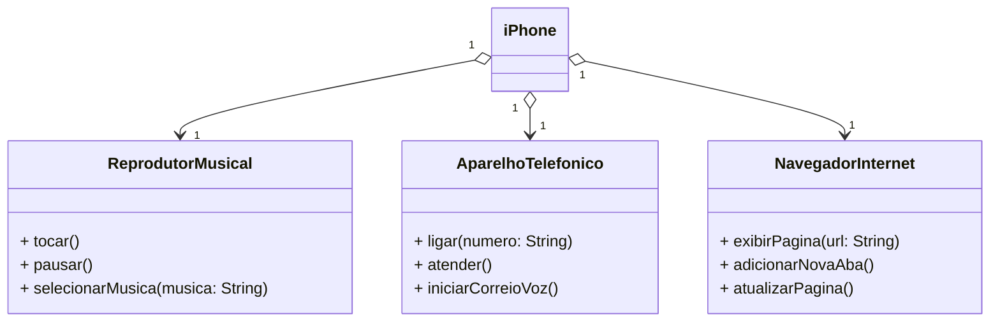

```mermaid
classDiagram
    class iPhone {
    }

    class ReprodutorMusical {
        + tocar()
        + pausar()
        + selecionarMusica(musica: String)
    }

    class AparelhoTelefonico {
        + ligar(numero: String)
        + atender()
        + iniciarCorreioVoz()
    }

    class NavegadorInternet {
        + exibirPagina(url: String)
        + adicionarNovaAba()
        + atualizarPagina()
    }

    iPhone "1" o--> "1" ReprodutorMusical
    iPhone "1" o--> "1" AparelhoTelefonico
    iPhone "1" o--> "1" NavegadorInternet
```
